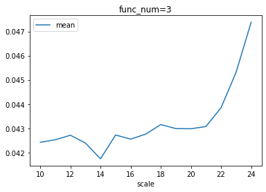
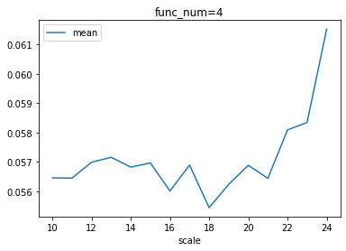
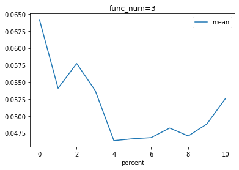
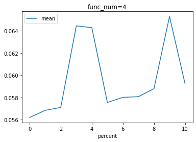
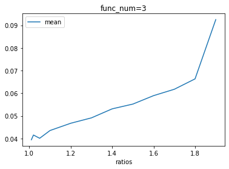
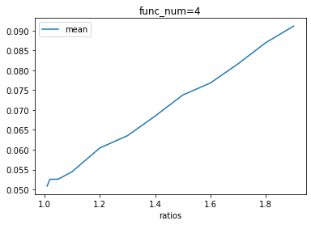
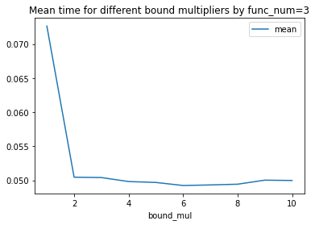
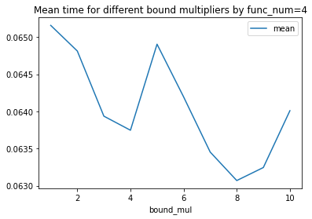

# cuckoohashing

## Build and Run
Make sure that nvcc is avilable or set `nvcc` path in `Makefile`
```bash
make clean && make &&./bench
```
and the result will be saved as `task1_cuda.csv`,`task1_serial.csv` ...

## cuckoohashing introduction

Cuckoo hashing is a simple hash table where

1. Lookups are worst-case $O(1)$.
2. Deletions are worst-case $O(1)$.
3. Insertions are amortized $O(1)$ with reasonably high probability.

This lab is a implication of CuckooHashing on `CUDA`. The parallelization processing will meet several challenges:

1. Seeing that hash look up or insert will access to uniformly distributed memory, this will introduce a large cache miss.
2.  Cuckoo hashing is a variation of the open addressing hashing algorithm, in which the addressing iteration can cause a lot of divergence across threads in a warp.
3. The  quality of the hash function have a large impact on the rehash times and hash function calculation efficiency.

## cuckoohashing gpu imply

I follow the following pseudo code to deploy the cuckoohashing  on CUDA.

```pseudocode
procedure Cuckoo-Hashing-Insert(H, T, k)
	for i 0 to k-1 do
		T[i] = empty
	end for
	for all t in T do
		Push-Back(T[h(t)], t)
	end for
	parallel for i 0 to k-1 do
		parallel for j 1 to T[i] do
			call Insert(H[i], T[i][j]) on block i
		end for
	end for
end procedure

procedure Insert(H, t) // kernel funtion
	z = -1
	while true do
		for i 0 to d - 1 do
			if H[h_i(t)] is empty then
				H[h_i(t)] = t
				z = i
				break
			end if
		end for
		if z != -1 and H[h_z(t)] = t then
			return
		end if
		r = (z + 1) % d
		ATOMIC_SWAP(H[h_r(t)], t)
	end while
end procedure
```

## Choice of Hash Function

So as to reduce the rehash times, we need a good hash function to decrease the probability of cillision.

I have tried some of the hash functions like `MUM`, or the original hash function mentioned in the paper: `[(c0 + c1 * k) mod 1900813]`. I choose `xxhash` at last, because an experiment has shown that `xxhash` is the fastest hash function with least collision, which result in nearly no rehash.

```c++
#define PRIME1 2654435761U
#define PRIME2 2246822519U
#define PRIME3 3266489917U
#define PRIME4 668265263U
#define PRIME5 374761393U

inline uint32_t rotate_left(uint32_t v, uint32_t n) {
  return (v << n) | (v >> (32 - n));
}

inline uint32_t xxhash(uint32_t seed, uint32_t v) {
  uint32_t acc = seed + PRIME5;

  acc = acc + v * PRIME3;
  acc = rotate_left(acc, 17) * PRIME4;

  uint8_t *byte = (uint8_t *)(&v);
  for (uint32_t i = 0; i < 4; i += 1) {
    acc = acc + byte[i] * PRIME5;
    acc = rotate_left(acc, 11) * PRIME1;
  }

  acc ^= acc >> 15;
  acc *= PRIME2;
  acc ^= acc >> 13;
  acc *= PRIME3;
  acc ^= acc >> 16;

  return acc;
}
```

## test env

```
machine: Tesla V100-PCIE NVIDIA-SMI 470.42.01    Driver Version: 470.42.01    CUDA Version: 11.4 

compiler:
nvcc: NVIDIA (R) Cuda compiler driver
Copyright (c) 2005-2019 NVIDIA Corporation
Built on Sun_Jul_28_19:07:16_PDT_2019
Cuda compilation tools, release 10.1, V10.1.243
```

## result
### task 1 




As expected, when the insert scale increase the insertion time is increasing because the collision times is increasing.

### task 2





 Seeing that the lookup procedure is nearly $O(1)$ and the CUDA version only affected by creating thread blocks, so the time is almost stable as long as the cuda device have enough threads.

### task 3






The results of the experiment indicate the hashing efficiency rules: a low load factor leads to greater performance.

### task 4





the result shows that when the bound multiplier is around `4` we will get an efficient insertion. And this is relied on the `hash table size`, `insertion size` and the `hash funciton number` . A research from `cudpp` have discovered a special math function to calculate the evict bound

```c++
int cal_evict_bound(uint32_t n, uint32_t table_size)
{
    float lg_input_size = log2(n);
    float load_factor = float(n) / table_size;
    float ln_load_factor = (float)(log(load_factor) / log(2.71828183));

    unsigned max_iterations = (unsigned)(4 * ceil(-1.0 / (0.028255 + 1.1594772 * ln_load_factor) * lg_input_size));
    return max_iterations;
}
```

But it doesn't have a good result with my code, So we can study this in the future.

## ref

https://github.com/cudpp/cudpp/blob/master/src/cudpp_hash/hash_table.cpp

https://github.com/cudpp/cudpp

https://arxiv.org/pdf/1712.09494.pdf

https://github.com/Cyan4973/xxHash

https://github.com/Cyan4973/xxHash/wiki/Collision-ratio-comparison#collision-study

https://hal.inria.fr/inria-00624777/document

https://mdsoar.org/bitstream/handle/11603/20126/paper.pdf?sequence=6&isAllowed=y

## raw data

### task 1
#### serial
|t       |scale|mean     |stddev     |
|--------|-----|---------|-----------|
|2       |10   |0.00294358|0.00117434 |
|2       |11   |0.00453888|2.50499e-05|
|2       |12   |0.00929965|0.000977017|
|2       |13   |0.0188897|0.00260624 |
|2       |14   |0.0311063|0.00196453 |
|2       |15   |0.048496 |0.000189106|
|2       |16   |0.0691273|0.00129734 |
|2       |17   |0.0836684|0.000473563|
|2       |18   |0.0991308|0.000285876|
|2       |19   |0.130948 |0.0050953  |
|2       |20   |0.193696 |0.00665161 |
|2       |21   |0.312579 |0.00654705 |
|2       |22   |0.579419 |0.0129313  |
|2       |23   |1.20794  |0.00717695 |
|2       |24   |6.31342  |2.57052    |
|3       |10   |0.00242764|4.84352e-05|
|3       |11   |0.00462542|4.73939e-05|
|3       |12   |0.00884682|7.31999e-05|
|3       |13   |0.0165434|5.152e-05  |
|3       |14   |0.0294167|0.000107872|
|3       |15   |0.0476152|0.000395084|
|3       |16   |0.0667526|0.000277471|
|3       |17   |0.0820039|0.000516152|
|3       |18   |0.0982705|0.000424502|
|3       |19   |0.128771 |0.00131435 |
|3       |20   |0.185879 |0.000716197|
|3       |21   |0.307996 |0.00141848 |
|3       |22   |0.575608 |0.0106     |
|3       |23   |1.17707  |0.00836132 |
|3       |24   |2.17964  |0.0107465  |
|4       |10   |0.00243318|2.03671e-05|
|4       |11   |0.00468536|8.1657e-05 |
|4       |12   |0.0089843|8.31572e-05|
|4       |13   |0.0167891|8.05382e-05|
|4       |14   |0.0297521|0.000109064|
|4       |15   |0.0477755|0.000342193|
|4       |16   |0.0675574|0.000561497|
|4       |17   |0.0823062|0.000275971|
|4       |18   |0.0980929|0.00081326 |
|4       |19   |0.12705  |0.000958727|
|4       |20   |0.187746 |0.00206568 |
|4       |21   |0.307825 |0.000470541|
|4       |22   |0.570981 |0.00454909 |
|4       |23   |1.16951  |0.0114623  |
|4       |24   |2.13056  |0.00607601 |

#### cuda

|t|scale|mean(s)     |stddev     |
|--------|-----|---------|-----------|
|2       |10   |0.0439475|0.031358   |
|2       |11   |0.028437 |0.000538266|
|2       |12   |0.029533 |0.00149321 |
|2       |13   |0.029754 |0.0014734  |
|2       |14   |0.0304956|0.00255695 |
|2       |15   |0.0287444|0.00074101 |
|2       |16   |0.0288483|0.000477728|
|2       |17   |0.0288742|0.000659089|
|2       |18   |0.0287951|0.000542492|
|2       |19   |0.0297718|0.0010092  |
|2       |20   |0.0294233|0.00063985 |
|2       |21   |0.0292366|0.000466167|
|2       |22   |0.0298903|0.000506495|
|2       |23   |0.0308985|0.000410042|
|2       |24   |0.0339043|0.00127225 |
|3       |10   |0.0424197|0.000729002|
|3       |11   |0.0425257|0.000471147|
|3       |12   |0.0427115|0.00092511 |
|3       |13   |0.042387 |0.00075543 |
|3       |14   |0.041738 |0.000511761|
|3       |15   |0.0427216|0.000867726|
|3       |16   |0.0425506|0.00127709 |
|3       |17   |0.0427581|0.000675577|
|3       |18   |0.0431516|0.00134628 |
|3       |19   |0.0429878|0.000797801|
|3       |20   |0.0429794|0.000995563|
|3       |21   |0.0430716|0.000920747|
|3       |22   |0.0438478|0.000834177|
|3       |23   |0.0453104|0.0011289  |
|3       |24   |0.0473812|0.00133997 |
|4       |10   |0.0564562|0.000283378|
|4       |11   |0.0564457|6.24392e-05|
|4       |12   |0.0569901|0.00179263 |
|4       |13   |0.0571567|0.00136263 |
|4       |14   |0.0568225|0.00153941 |
|4       |15   |0.0569652|0.0014114  |
|4       |16   |0.0560084|0.00047187 |
|4       |17   |0.0568908|0.00094533 |
|4       |18   |0.0554421|0.000156175|
|4       |19   |0.0562346|0.000510276|
|4       |20   |0.0568849|0.00120743 |
|4       |21   |0.0564395|0.000591619|
|4       |22   |0.0580903|0.00159833 |
|4       |23   |0.0583454|0.00131948 |
|4       |24   |0.0615281|0.00180113 |

### task 2
#### serial
|func_num|percent|mean     |stddev     |
|--------|-------|---------|-----------|
|3       |0      |1.34678  |0.0587823  |
|3       |1      |1.41286  |0.0877683  |
|3       |2      |1.37728  |0.00966961 |
|3       |3      |1.40732  |0.00638956 |
|3       |4      |1.43947  |0.00867214 |
|3       |5      |1.456    |0.0197337  |
|3       |6      |1.49219  |0.00751178 |
|3       |7      |1.54796  |0.0736653  |
|3       |8      |1.53773  |0.0125593  |
|3       |9      |1.56582  |0.00917863 |
|3       |10     |1.60554  |0.021908   |
|4       |0      |1.43469  |0.0177649  |
|4       |1      |1.48251  |0.0227062  |
|4       |2      |1.52871  |0.0226731  |
|4       |3      |1.57684  |0.0142959  |
|4       |4      |1.63308  |0.0164356  |
|4       |5      |1.67967  |0.0238586  |
|4       |6      |1.70774  |0.0231868  |
|4       |7      |1.75888  |0.0233812  |
|4       |8      |1.81261  |0.0148471  |
|4       |9      |1.81874  |0.00303701 |
|4       |10     |1.88467  |0.0165726  |

#### cuda
|func_num|percent|mean     |stddev     |
|--------|-------|---------|-----------|
|3       |0      |0.0641776|0.0154878  |
|3       |1      |0.0540872|0.013985   |
|3       |2      |0.057729 |0.0148768  |
|3       |3      |0.053734 |0.0140887  |
|3       |4      |0.0463816|8.02272e-05|
|3       |5      |0.0466504|0.000302077|
|3       |6      |0.0468175|0.000140561|
|3       |7      |0.0482275|0.00258002 |
|3       |8      |0.0470635|3.9098e-05 |
|3       |9      |0.0488269|0.00133298 |
|3       |10     |0.0525858|0.00708853 |
|4       |0      |0.056194 |0.000200821|
|4       |1      |0.0568326|0.000866486|
|4       |2      |0.0570963|0.000747452|
|4       |3      |0.0644422|0.0135237  |
|4       |4      |0.0642838|0.0132718  |
|4       |5      |0.0575442|6.62837e-05|
|4       |6      |0.0580009|0.000212051|
|4       |7      |0.0580671|6.12257e-05|
|4       |8      |0.0587873|0.000668385|
|4       |9      |0.0652892|0.0133975  |
|4       |10     |0.0592308|0.000674014|


### task 3
#### serial
|func_num|ratios|mean     |stddev     |
|--------|------|---------|-----------|
|3       |1.9   |2.3893   |0.249726   |
|3       |1.8   |2.31445  |0.0172794  |
|3       |1.7   |2.40922  |0.0549364  |
|3       |1.6   |2.53768  |0.036038   |
|3       |1.5   |2.70946  |0.0239621  |
|3       |1.4   |2.8919   |0.0256617  |
|3       |1.3   |3.21708  |0.0125243  |
|3       |1.2   |6.33848  |1.89421    |
|3       |1.1   |12.0994  |3.75464    |
|3       |1.05  |8.24154  |1.64733    |
|3       |1.02  |10.2252  |3.61084    |
|3       |1.01  |9.26819  |2.64024    |
|4       |1.9   |2.20334  |0.00657852 |
|4       |1.8   |2.24865  |0.00849129 |
|4       |1.7   |2.32576  |0.00664565 |
|4       |1.6   |2.41653  |0.012299   |
|4       |1.5   |2.56341  |0.0206585  |
|4       |1.4   |2.67255  |0.00898152 |
|4       |1.3   |2.9339   |0.0177339  |
|4       |1.2   |3.39156  |0.0188618  |
|4       |1.1   |8.2102   |3.26455    |
|4       |1.05  |9.86271  |1.67544    |
|4       |1.02  |15.7333  |2.37041    |
|4       |1.01  |10.9119  |2.16711    |

#### cuda
|func_num|ratios|mean     |stddev     |
|--------|------|---------|-----------|
|3       |1.9   |0.0924973|0.0395274  |
|3       |1.8   |0.0663222|0.00146865 |
|3       |1.7   |0.0617394|0.000625437|
|3       |1.6   |0.0589297|0.00164882 |
|3       |1.5   |0.055202 |0.00120727 |
|3       |1.4   |0.0530938|0.0010728  |
|3       |1.3   |0.0491142|0.000880428|
|3       |1.2   |0.0467326|0.00058291 |
|3       |1.1   |0.0435251|0.0015199  |
|3       |1.05  |0.0400999|0.000109168|
|3       |1.02  |0.0415416|0.00143584 |
|3       |1.01  |0.0394398|0.000970893|
|4       |1.9   |0.0911189|0.00193572 |
|4       |1.8   |0.0869779|0.00164433 |
|4       |1.7   |0.0816485|0.00193868 |
|4       |1.6   |0.0768154|0.00127531 |
|4       |1.5   |0.0737705|0.00305763 |
|4       |1.4   |0.0684717|0.00120234 |
|4       |1.3   |0.0635253|0.00137649 |
|4       |1.2   |0.0604276|0.00139355 |
|4       |1.1   |0.0544544|0.000986151|
|4       |1.05  |0.052581 |0.00138648 |
|4       |1.02  |0.0525545|0.000971579|
|4       |1.01  |0.0508431|0.000653479|


### task 4
#### serial
|func_num|bound_mul|mean     |stddev     |
|--------|---------|---------|-----------|
|3       |1        |6.67216  |1.8861     |
|3       |2        |2.9423   |0.0529595  |
|3       |3        |2.89136  |0.00846956 |
|3       |4        |2.89256  |0.00984937 |
|3       |5        |2.90935  |0.035254   |
|3       |6        |2.86938  |0.0100022  |
|3       |7        |2.878    |0.019243   |
|3       |8        |2.88295  |0.0103433  |
|3       |9        |2.88911  |0.0175928  |
|3       |10       |2.87754  |0.00822457 |
|4       |1        |2.68566  |0.0162709  |
|4       |2        |2.68867  |0.0135275  |
|4       |3        |2.67755  |0.00633684 |
|4       |4        |2.67851  |0.00671768 |
|4       |5        |2.67755  |0.00890246 |
|4       |6        |2.6794   |0.00797972 |
|4       |7        |2.68103  |0.0145091  |
|4       |8        |2.67792  |0.00583736 |
|4       |9        |2.6827   |0.00952223 |
|4       |10       |2.69846  |0.0346252  |

#### cuda
|func_num|bound_mul|mean     |stddev     |
|--------|---------|---------|-----------|
|3       |1        |0.0726327|0.0402696  |
|3       |2        |0.050474 |0.00153943 |
|3       |3        |0.0504257|0.0018765  |
|3       |4        |0.0498386|0.00025331 |
|3       |5        |0.0497058|0.000148922|
|3       |6        |0.0492598|0.00140374 |
|3       |7        |0.0493404|0.00112154 |
|3       |8        |0.0494495|0.000546652|
|3       |9        |0.0500446|0.00111553 |
|3       |10       |0.0499941|0.00189854 |
|4       |1        |0.0651577|0.000844501|
|4       |2        |0.0648131|0.000587351|
|4       |3        |0.0639362|0.00140711 |
|4       |4        |0.0637468|0.00120811 |
|4       |5        |0.0649046|0.0013293  |
|4       |6        |0.0641954|0.00133467 |
|4       |7        |0.0634533|0.00158846 |
|4       |8        |0.0630698|0.00117277 |
|4       |9        |0.0632451|0.00168766 |
|4       |10       |0.06401  |0.000882801|